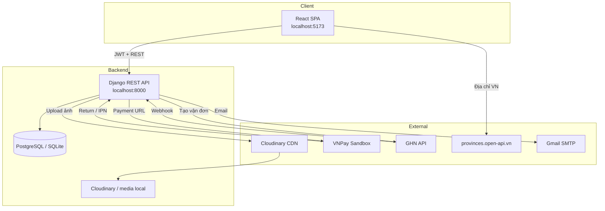

<p align="center">
  
</p>

<h1 align="center">PitchZone Store</h1>

<p align="center">
  Cửa hàng bán đồ bóng đá trực tuyến — React + Django REST API<br/>
  Hỗ trợ checkout COD/VNPay, voucher, vận chuyển GHN và bảng quản trị đầy đủ.
</p>

<p align="center">
  
</p>

---

## Mục lục

- [Giới thiệu](#giới-thiệu)
- [Ảnh giao diện](#ảnh-giao-diện)
- [Tính năng](#tính-năng)
- [Công nghệ](#công-nghệ)
- [Kiến trúc](#kiến-trúc)
- [Cấu trúc thư mục](#cấu-trúc-thư-mục)
- [Yêu cầu hệ thống](#yêu-cầu-hệ-thống)
- [Cài đặt](#cài-đặt)
- [Biến môi trường](#biến-môi-trường)
- [Lưu trữ ảnh (Cloudinary)](#lưu-trữ-ảnh-cloudinary)
- [Seed dữ liệu mẫu](#seed-dữ-liệu-mẫu)
- [Chạy development](#chạy-development)
- [API chính](#api-chính)
- [Thanh toán VNPay](#thanh-toán-vnpay)
- [Vận chuyển GHN](#vận-chuyển-ghn)
- [Kiểm thử](#kiểm-thử)
- [Lệnh quản trị hữu ích](#lệnh-quản-trị-hữu-ích)
- [Xử lý sự cố](#xử-lý-sự-cố)
- [Giấy phép](#giấy-phép)

---

## Giới thiệu

**PitchZone Store** là dự án e-commerce chuyên bán giày, quần áo và phụ kiện bóng đá. Frontend là SPA React (Vite + Tailwind CSS 4), backend là Django REST Framework với JWT authentication.

Dự án gồm hai phần rõ ràng:

| Phần | Mô tả |
|------|--------|
| **Cửa hàng** | Duyệt sản phẩm, giỏ hàng, checkout, đơn hàng, hồ sơ khách hàng |
| **Admin** | Dashboard, quản lý đơn hàng, sản phẩm, deal sốc, voucher, danh mục, thương hiệu, người dùng |

---

## Ảnh giao diện

> Các ảnh dưới đây dùng asset có sẵn trong repo.  
> **Phần chụp màn hình UI** — thêm file vào `docs/screenshots/` rồi thay dòng `TODO` bằng đường dẫn thật.

### Banner & branding (có sẵn)

| | |
|---|---|
|  |  |

### Cửa hàng — *TODO: tự thêm ảnh chụp màn hình*

| Màn hình | File cần thêm | Gợi ý |
|----------|---------------|-------|
| Trang chủ | `docs/screenshots/01-home.png` | Hero, danh mục, deal nổi bật |
| Danh sách sản phẩm | `docs/screenshots/02-products.png` | Bộ lọc, lưới sản phẩm |
| Chi tiết sản phẩm | `docs/screenshots/03-product-detail.png` | Ảnh, size, đánh giá |
| Giỏ hàng | `docs/screenshots/04-cart.png` | Cập nhật số lượng |
| Checkout | `docs/screenshots/05-checkout.png` | Địa chỉ, voucher, COD/VNPay |
| Đơn hàng | `docs/screenshots/06-orders.png` | Lịch sử & chi tiết đơn |

```markdown
<!-- Sau khi thêm ảnh, bỏ comment các dòng dưới: -->
<!--  -->
<!--  -->
<!--  -->
<!--  -->
<!--  -->
<!--  -->
```

### Admin — *TODO: tự thêm ảnh chụp màn hình*

| Màn hình | File cần thêm | Gợi ý |
|----------|---------------|-------|
| Dashboard | `docs/screenshots/07-admin-dashboard.png` | Biểu đồ, thống kê |
| Đơn hàng | `docs/screenshots/08-admin-orders.png` | Timeline, đổi trạng thái |
| Sản phẩm | `docs/screenshots/09-admin-products.png` | Bảng + modal biến thể |
| Deal sốc | `docs/screenshots/10-admin-promotions.png` | Campaign cards |
| Voucher | `docs/screenshots/11-admin-vouchers.png` | Mã giảm giá |
| Người dùng | `docs/screenshots/12-admin-users.png` | Bảng + sửa quyền admin |

```markdown
<!--  -->
<!--  -->
<!--  -->
<!--  -->
<!--  -->
<!--  -->
```

---

## Tính năng

### Cửa hàng (khách hàng)

- Trang chủ với banner, danh mục, sản phẩm nổi bật và deal sốc
- Lọc sản phẩm theo danh mục, thương hiệu, giá, từ khóa
- Chi tiết sản phẩm: biến thể size, tồn kho, đánh giá
- Giỏ hàng (thêm / sửa / xóa, đồng bộ khi đăng nhập)
- Checkout: chọn địa chỉ (API tỉnh/huyện/xã), voucher, phí ship
- Thanh toán **COD** hoặc **VNPay Sandbox**
- Lịch sử đơn hàng, chi tiết đơn, trang thành công
- Tài khoản: đăng ký, đăng nhập JWT, quên/đổi mật khẩu, hồ sơ, sổ địa chỉ
- Trang thông tin: Giới thiệu, FAQ, Chính sách, Liên hệ

### Quản trị (admin — `is_staff`)

- Dashboard: doanh thu, đơn hàng, biểu đồ
- Đơn hàng: xem chi tiết, timeline, cập nhật trạng thái, tạo vận đơn GHN
- Sản phẩm: CRUD, upload ảnh, quản lý biến thể (size/stock)
- Deal sốc (promotions): campaign theo thời gian, gắn sản phẩm
- Voucher: mã %, cố định, giới hạn lượt dùng
- Danh mục & thương hiệu
- Người dùng: sửa hồ sơ, cấp/quyền admin

### Tích hợp bên thứ ba

| Dịch vụ | Mục đích |
|---------|----------|
| **VNPay** | Tạo URL thanh toán, verify chữ ký SHA512, IPN & return |
| **GHN** | Tạo vận đơn, webhook cập nhật trạng thái giao hàng |
| **Gmail SMTP** | Email xác nhận đơn, reset mật khẩu |
| **provinces.open-api.vn** | Chọn tỉnh / phường khi checkout |

### Phí vận chuyển (mặc định)

| Điều kiện | Phí |
|-----------|-----|
| Đơn ≥ 2.000.000 ₫ | Miễn phí |
| TP.HCM / Hà Nội | 30.000 ₫ |
| Tỉnh khác | 50.000 ₫ |

---

## Công nghệ

### Backend

| Thư viện | Phiên bản |
|----------|-----------|
| Python | 3.11+ |
| Django | 5.2 |
| Django REST Framework | 3.17 |
| djangorestframework-simplejwt | 5.5 |
| django-cors-headers | 4.9 |
| django-filter | 25.2 |
| PostgreSQL / SQLite | Tùy cấu hình |
| Pillow | Upload ảnh |

### Frontend

| Thư viện | Phiên bản |
|----------|-----------|
| React | 19 |
| Vite | 8 |
| React Router | 7 |
| Tailwind CSS | 4 |
| Axios | HTTP client |
| Recharts | Biểu đồ admin |

---

## Kiến trúc



**Luồng checkout VNPay:**

1. Khách đặt hàng → backend tạo `Order` + `vnpay_txn_ref`
2. Backend ký SHA512 → redirect sang VNPay
3. VNPay gọi IPN + redirect về `/api/payments/vnpay/return/`
4. Backend verify chữ ký → cập nhật `payment_status`
5. Frontend `/payment/vnpay/return` hiển thị kết quả

---

## Cấu trúc thư mục

```
pitchzone-store/
├── backend/
│   ├── accounts/          # User, profile, địa chỉ, auth JWT
│   ├── catalog/           # Sản phẩm, danh mục, brand, promotion, review
│   ├── carts/             # Giỏ hàng
│   ├── orders/            # Đơn hàng, voucher, VNPay, GHN
│   ├── config/            # settings, urls, pagination
│   ├── requirements.txt
│   └── .env.example
├── frontend/
│   ├── src/
│   │   ├── api/           # Axios clients
│   │   ├── components/  # UI components
│   │   ├── pages/         # Route pages
│   │   ├── layouts/       # MainLayout, AdminLayout
│   │   └── config/        # Nội dung tĩnh, env
│   ├── .env.example
│   └── package.json
├── docs/
│   └── screenshots/       # Ảnh chụp màn hình README (tự thêm)
└── README.md
```

---

## Yêu cầu hệ thống

- **Python** 3.11 trở lên
- **Node.js** 20 trở lên (khuyến nghị LTS)
- **PostgreSQL** 14+ (tùy chọn — có thể dùng SQLite dev)
- **Git**

---

## Cài đặt

### 1. Clone repository

```bash
git clone <repo-url> pitchzone-store
cd pitchzone-store
```

### 2. Backend

```bash
cd backend

# Tạo virtualenv (Windows)
python -m venv ../venv
..\venv\Scripts\activate

# Hoặc Linux/macOS
# python -m venv ../venv && source ../venv/bin/activate

pip install -r requirements.txt
copy .env.example .env        # Windows
# cp .env.example .env        # Linux/macOS

python manage.py migrate
python manage.py createsuperuser   # Tài khoản admin (is_staff=True)
```

**Dùng SQLite thay PostgreSQL (dev nhanh):** trong `.env` đặt hoặc xóa dòng `DB_ENGINE` — mặc định sẽ dùng `backend/db.sqlite3`.

### 3. Frontend

```bash
cd ../frontend
npm install
copy .env.example .env        # Windows
# cp .env.example .env
```

---

## Biến môi trường

### Backend (`backend/.env`)

| Biến | Mô tả | Mặc định / ví dụ |
|------|--------|------------------|
| `DJANGO_SECRET_KEY` | Secret key Django | *bắt buộc đổi khi production* |
| `DJANGO_DEBUG` | Chế độ debug | `True` |
| `DB_ENGINE` | `postgresql` hoặc bỏ trống → SQLite | `postgresql` |
| `DB_NAME`, `DB_USER`, `DB_PASSWORD`, `DB_HOST`, `DB_PORT` | PostgreSQL | xem `.env.example` |
| `CORS_ALLOWED_ORIGINS` | Origin frontend | `http://localhost:5173` |
| `FRONTEND_URL` | URL redirect VNPay | `http://localhost:5173` |
| `VNPAY_TMN_CODE` | Mã merchant VNPay | Sandbox credentials |
| `VNPAY_HASH_SECRET` | Secret ký HMAC SHA512 | Sandbox credentials |
| `VNPAY_RETURN_URL` | URL return backend | `http://127.0.0.1:8000/api/payments/vnpay/return/` |
| `VNPAY_IPN_URL` | URL IPN backend | `http://127.0.0.1:8000/api/payments/vnpay/ipn/` |
| `GHN_TOKEN`, `GHN_SHOP_ID` | Token GHN | Tùy chọn |
| `EMAIL_HOST_USER`, `EMAIL_HOST_PASSWORD` | Gmail App Password | Tùy chọn |
| `CLOUDINARY_CLOUD_NAME` | Cloud name | *bắt buộc khi deploy* |
| `CLOUDINARY_API_KEY` | API key | *bắt buộc khi deploy* |
| `CLOUDINARY_API_SECRET` | API secret | *bắt buộc khi deploy* |
| `USE_CLOUDINARY` | Bật Cloudinary (dev) | `True` — mặc định tự bật khi đủ 3 biến trên |

### Frontend (`frontend/.env`)

| Biến | Mô tả | Ví dụ |
|------|--------|-------|
| `VITE_API_BASE_URL` | Base API (kết thúc `/api`) | `http://127.0.0.1:8000/api` |
| `VITE_ADDRESS_API_BASE` | API địa chỉ VN | `https://provinces.open-api.vn/api/v2` |
| `VITE_APP_NAME` | Tên tab trình duyệt | `PitchZone` |
| `VITE_FREE_SHIPPING_THRESHOLD` | Ngưỡng freeship (VND) | `2000000` |
| `VITE_MEDIA_BASE_URL` | Origin ảnh `/media/` local | *Không cần khi dùng Cloudinary* — API trả URL đầy đủ |

---

## Lưu trữ ảnh (Cloudinary)

Ảnh upload (sản phẩm, danh mục, thương hiệu, avatar) dùng **Cloudinary** khi deploy — filesystem container (Render, Railway, Fly.io…) không giữ file lâu dài.

| Môi trường | Storage |
|------------|---------|
| Dev (không cấu hình Cloudinary) | `backend/media/` local |
| Dev / Production (có 3 biến Cloudinary) | Cloudinary CDN |
| Test (`manage.py test`) | SQLite + local storage |

### Cấu hình

1. Tạo tài khoản tại [cloudinary.com](https://cloudinary.com/)
2. Dashboard → **API Keys** → copy `Cloud name`, `API Key`, `API Secret`
3. Thêm vào `backend/.env`:

```env
CLOUDINARY_CLOUD_NAME=your_cloud_name
CLOUDINARY_API_KEY=your_api_key
CLOUDINARY_API_SECRET=your_api_secret
```

Khi đủ 3 biến, Django tự dùng `MediaCloudinaryStorage`. Không cần đổi model hay frontend — API trả URL dạng `https://res.cloudinary.com/...`.

### Deploy checklist

```bash
# Sau khi deploy backend với Cloudinary credentials
python manage.py migrate
python manage.py seed_catalog        # Upload ảnh mẫu lên Cloudinary
# hoặc upload lại ảnh qua admin / API
```

> Ảnh cũ trong `backend/media/` **không** tự migrate. Chạy lại `seed_catalog` hoặc upload lại qua admin.

Ảnh tĩnh UI (banner, logo trong `frontend/src/assets/`) vẫn bundle cùng frontend — không qua Cloudinary.

### Deploy trên Render — đưa data lên production

Render **chỉ tự chạy `migrate`** khi start container. Dữ liệu sản phẩm / admin **phải seed thủ công** qua Shell.

**Bước 1 — Environment (Dashboard → `pitchzone-api` → Environment):**

| Biến | Bắt buộc |
|------|----------|
| `CLOUDINARY_CLOUD_NAME`, `CLOUDINARY_API_KEY`, `CLOUDINARY_API_SECRET` | Có — ảnh SP |
| `VNPAY_TMN_CODE`, `VNPAY_HASH_SECRET` | Nếu dùng VNPay |
| `EMAIL_HOST_USER`, `EMAIL_HOST_PASSWORD` | Nếu gửi email |

**Bước 2 — Shell (Dashboard → `pitchzone-api` → Shell):**

```bash
# Kiểm tra Cloudinary
python manage.py check_cloudinary

# Seed toàn bộ demo: sản phẩm + deal + voucher
python manage.py seed_all

# Tạo admin (đặt DJANGO_SUPERUSER_PASSWORD trong Environment trước)
python manage.py create_admin

# Hoặc tương tác
python manage.py createsuperuser
```

**Bước 3 — Đăng nhập:**

- Cửa hàng: `https://pitchzone-web.onrender.com`
- Admin: `https://pitchzone-web.onrender.com/admin` (tài khoản `is_staff`)

**Cách 2 — Copy DB từ máy local (nếu đã có data thật):**

```bash
# Máy local — export PostgreSQL
pg_dump -h localhost -U pickzone_user -d pickzone_db -F c -f pitchzone.dump

# Render — lấy External Database URL (Dashboard → pitchzone-db → Connect)
pg_restore --clean --no-owner -d "<RENDER_DATABASE_URL>" pitchzone.dump
```

> Sau `pg_restore`, ảnh vẫn cần Cloudinary — URL `/media/` local sẽ không hoạt động trên Render. Chạy `seed_all` hoặc upload lại ảnh.

---

## Seed dữ liệu mẫu

```bash
cd backend
python manage.py seed_all           # Catalog + deal + voucher (khuyến nghị)
python manage.py seed_catalog       # Chỉ danh mục, brand, sản phẩm, ảnh
python manage.py seed_promotions     # Chỉ deal sốc + voucher
python manage.py create_admin       # Tạo admin từ DJANGO_SUPERUSER_*
```

Lệnh `seed_catalog` tạo giày Nike/Adidas/Puma, quần áo, phụ kiện kèm ảnh sinh tự động.

---

## Chạy development

Mở **hai terminal**:

```bash
# Terminal 1 — Backend
cd backend
python manage.py runserver
# → http://127.0.0.1:8000

# Terminal 2 — Frontend
cd frontend
npm run dev
# → http://localhost:5173
```

| URL | Mô tả |
|-----|--------|
| http://localhost:5173 | Cửa hàng |
| http://localhost:5173/admin | Bảng quản trị (cần `is_staff`) |
| http://127.0.0.1:8000/api/health/ | Health check API |
| http://127.0.0.1:8000/admin/ | Django admin gốc |

**Tài khoản admin:** dùng `createsuperuser` hoặc vào Django admin bật `is_staff` cho user.

---

## API chính

Base URL: `http://127.0.0.1:8000/api`

### Auth (`/api/auth/`)

| Method | Endpoint | Mô tả |
|--------|----------|-------|
| POST | `/register/` | Đăng ký |
| POST | `/login/` | Lấy access + refresh token |
| POST | `/refresh/` | Làm mới token |
| GET/PATCH | `/me/`, `/profile/` | Hồ sơ người dùng |
| CRUD | `/addresses/` | Sổ địa chỉ |
| POST | `/forgot-password/`, `/reset-password/` | Quên mật khẩu |

### Catalog (`/api/`)

| Resource | Mô tả |
|----------|-------|
| `/categories/` | Danh mục |
| `/brands/` | Thương hiệu |
| `/products/` | Sản phẩm (filter, search) |
| `/variants/` | Biến thể size |
| `/promotions/` | Deal sốc công khai |
| `/reviews/` | Đánh giá sản phẩm |

### Cart & Orders

| Method | Endpoint | Mô tả |
|--------|----------|-------|
| GET/PATCH | `/cart/` | Giỏ hàng |
| POST | `/orders/` | Tạo đơn (checkout) |
| GET | `/orders/` | Lịch sử đơn |
| POST | `/vouchers/validate/` | Kiểm tra mã giảm giá |
| POST | `/payments/vnpay/verify/` | Xác minh return VNPay |

### Admin (`/api/admin/` — yêu cầu staff)

| Resource | Mô tả |
|----------|-------|
| `/admin/users/` | Quản lý người dùng |
| `/admin/promotions/` | Deal sốc |
| `/admin/vouchers/` | Voucher |
| `/orders/admin/dashboard/` | Thống kê dashboard |

---

## Thanh toán VNPay

### Đăng ký Sandbox

1. Đăng ký tại [sandbox.vnpayment.vn](https://sandbox.vnpayment.vn/devreg/)
2. Lấy `TmnCode` và `HashSecret` → điền vào `backend/.env`
3. Đăng ký **Return URL** và **IPN URL** trên merchant portal — phải khớp `.env`:

```
VNPAY_RETURN_URL=http://127.0.0.1:8000/api/payments/vnpay/return/
VNPAY_IPN_URL=http://127.0.0.1:8000/api/payments/vnpay/ipn/
```

> Alias `/vnpay/return/` và `/vnpay/ipn/` cũng có sẵn nếu merchant đăng ký URL ngắn hơn.

### Kiểm tra cấu hình

```bash
cd backend
python manage.py test_vnpay          # In cấu hình + test hash
python manage.py test orders.tests.VNPayHashTests
```

### Lỗi chữ ký thường gặp

| Nguyên nhân | Cách xử lý |
|-------------|------------|
| `HashSecret` sai | Copy lại từ merchant portal |
| Return URL không khớp merchant | URL trong `.env` = URL đã đăng ký VNPay |
| Số tiền lệch | `vnp_Amount` = `total_price × 100` (VND) |

---

## Vận chuyển GHN

Cấu hình `GHN_TOKEN`, `GHN_SHOP_ID` và địa chỉ kho trong `.env`. Admin có thể tạo vận đơn từ trang đơn hàng.

Webhook GHN: `POST /api/webhooks/ghn/`

Sandbox: đặt `GHN_USE_SANDBOX=True`.

---

## Kiểm thử

```bash
# Backend — dùng SQLite in-memory, không cần quyền CREATE DATABASE
cd backend
python manage.py test

# Frontend
cd frontend
npm run lint
npm run build
```

---

## Lệnh quản trị hữu ích

```bash
cd backend

python manage.py seed_catalog           # Dữ liệu sản phẩm mẫu
python manage.py seed_promotions        # Deal sốc mẫu
python manage.py test_vnpay               # Kiểm tra VNPay
python manage.py create_vnpay_order       # Tạo đơn test VNPay
python manage.py expire_vnpay_orders      # Hủy đơn VNPay quá hạn
python manage.py download_product_images  # Tải ảnh SP (nếu cần)
```

---

## Xử lý sự cố

| Vấn đề | Giải pháp |
|--------|-----------|
| CORS lỗi | Thêm origin frontend vào `CORS_ALLOWED_ORIGINS` |
| Ảnh sản phẩm không hiện | Local: kiểm tra `VITE_API_BASE_URL`. Deploy: kiểm tra 3 biến Cloudinary + chạy lại `seed_catalog` |
| Ảnh mất sau deploy | Bật Cloudinary — filesystem deploy không persistent |
| Port 5173 bận | Vite tự chuyển 5174 — thêm origin đó vào CORS |
| Test DB permission denied | Đã xử lý: test tự dùng SQLite `:memory:` |
| VNPay redirect lỗi chữ ký | Xem mục [Thanh toán VNPay](#thanh-toán-vnpay) |
| Admin không vào được | User cần `is_staff=True` |

---

## Giấy phép

Dự án học tập / demo. Chưa có giấy phép mã nguồn chính thức — liên hệ maintainer trước khi dùng thương mại.

---

<p align="center">
  <sub>PitchZone Store — Built with Django & React</sub>
</p>